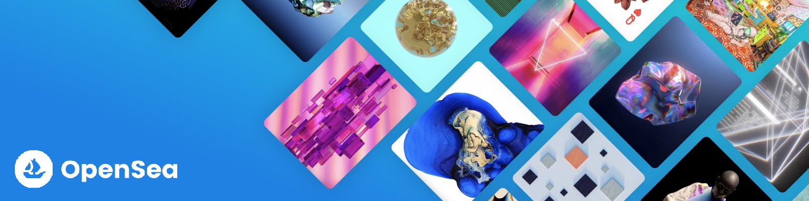

## Opensea 1.0

## Table of Contents

- [Introduction](#introduction)
- [Features](#features)
- [Build Process](#build-process)
- [Tech Stack](#tech-stack)

 

## Introduction

This is a decentralized Opensea clone project that can buy nun fungible tokens (NFT's) using ethereum using your metamask wallet.

## Features

🚀 Buy NFT's  
🚀 Authentication using Metamask

## Build Process

- Clone or download the repo
- `npm install` or `yarn` to install dependencies
- `npm start` or `yarn run dev` to run the application

## Tech Stack

    
    
    
    
    
    

## Project Goals & Outcomes

✔️ Learning Thirdweb & Metamask Authentication  
✔️ Learning How NFT Works  
✔️ Learning Sanity CMS  
✔️ Learning Tailwind CSS